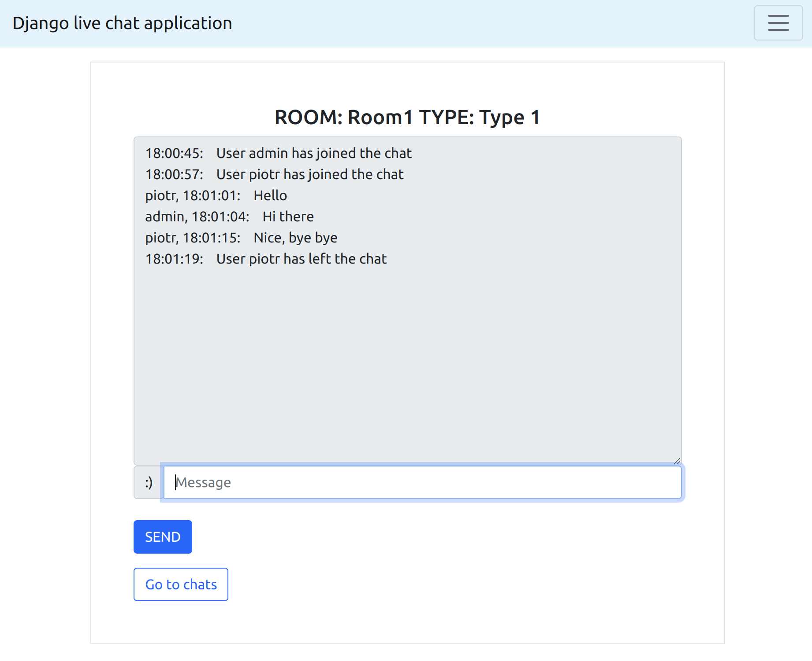

# Chat web app

## Table of contents
* [General info](#general-info)
* [Details ](#details)
* [Technologies](#technologies)
* [Setup before run](#setup-before-run)
* [TESTS](#tests)
* [Run](#run)
* [Deploy on GCP](#deploy-on-gcp)

## General info
This is a web application with live chats and custom user authentication. It uses Bootstrap on the frontend.

The app was deployed on the GCP using CI/CD. Each time someone pushes changes to the main branch, GithHub Workflow starts a job and updates the app version on the GCP. You can access the deployed application via the following link:
https://django-chat-app-414723.lm.r.appspot.com/

You can find some screenshots in the [docs](./docs/) folder.

## Details

Only logged-in users can join the chat. You can create an account using the registration option. Additionally, each account has a type (currently, for example purposes, types are: Type 1, Type 2). There are two rooms (1,2) accessible only to accounts with Type 1, and two rooms (3,4) accessible only to Type 2 accounts Users can change their account type in the settings.

The chat app displays information about user joining/leaving the chat, as well as their messages. Additionaly, it shows the time when each message was sent. It doesn't store the history of messages. 



## Technologies
* Python 3.10
* Django 5.0
* Django Channels 4.0
* Google Cloud Platform (GCP)
* POSTGRESQL 16.0
* REDIS 7.0
* BOOTSTRAP 5.0

## Setup before run
1. To run the app locally, you need to set up enviroment variables. You can find an example [env_file](./docs/example_env_file) in the docs folder.

2. Next run the REDIS instance, for example, with Docker:

    ```
    $ docker run --rm -p 6379:6379 redis:7
    ```

3. Next, set up the databse. You can do this locally or on GCP with PostgreSQL

- If you want to connect to a GCP database, first setup PostgreSQL on GCP, then download the Cloud SQL Proxy from GCP. Run the following command and set appropriate env variables in the env file:
    ```
    $ ./cloud_sql_proxy -instances="{PROJECT_ID}:{REGION}:{DB_INSTANCE}"=tcp:5432
    ```
- If you want to run the app locally, just uncomment 121-124 lines in the [settings.py](./chat_app/settings.py) file and comment line 125.

4. After completing all these steps, run the following commands (in a virtual venv). Additionaly you can create a superuser.
    
    ```
    $ python3 manage.py makemigrations
    $ python manage.py migrate
    ```

## Tests
Install all the requirements and set up virtual enviroments using the following command:

```
$ make install
```

Next, execute (in the virtual enviroment) the following command to ensure, that the set up was successful:

```
$ python3 manage.py test
```

## Run
To run the application, execute the following command. 
This command will also install all the necessary dependencies if they haven't been installed yet.

```
$ make run
```

To set up the development enviroment and run the app, execute the following command.
This will install useful packages for development, such as the Black formatter and Isort.

```
$ make run_dev
```

## Deploy on GCP

USED SERVICES:

- App Engine (to host the app)
- Cloud SQL (to store user data)
- SECRET MANAGER (for env variables)
- Memorystore REDIS (for channel layer)
- VPC network (to connect with Redis instance)

You can use the GitHub Workflow to deploy this application on App Engine. Firstly, set up your project on GCP. Remember to add ACCOUNT SERVICE and grant it all the necessary permissions (such as access to Cloud SQL, secrets etc.). Since the app is using Web Sockets, it has to be deployed (as of February 2024) on the flexible enviroment. 

Before deployment set up GitHub Secrets:

- CLOUD_SQL_INSTANCE_CONNECTION_NAME
- CLOUD_VPC_CONNECTOR_NAME
- PROJECT_ID
- SERVICE_ACCOUNT

Rembeber to set up secrets in the Secret Manager, you can find an example [secret_file](./docs/example_GCP_secrets) in the docs folder.